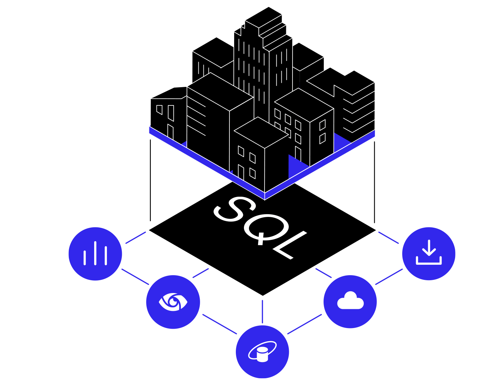

# Vision-AI

<div align="center">
  
</div>

## Description

Organizations often struggle with efficiently accessing and understanding client data stored in internal databases. Traditional methods of data retrieval and analysis can be time-consuming and cumbersome, leading to delays in decision-making and inefficiencies in client management. There is a need for a streamlined and intuitive solution that allows organization members to query and receive timely, accurate insights from the database through a user-friendly interface.

## Architecture

<div align="center">
  
</div>

## Features

### 1. User-Friendly Database Querying

Vision-AI provides an intuitive and user-friendly interface that allows organization members to query their internal databases using natural language. Instead of writing complex SQL queries or navigating through a series of menus, users can simply type their questions in plain English. The system leverages a sophisticated LLM to understand the intent behind the queries and translates them into accurate database queries. This feature not only saves time but also makes data access more democratic, enabling even non-technical staff to extract valuable insights from the data.

Key Benefits:
- Simplifies the process of data retrieval.
- Reduces the need for technical expertise.
- Increases efficiency in decision-making processes.
- Provides accurate and contextually relevant responses.

### 2. Chat-Based CSV Querying

Vision-AI extends its powerful querying capabilities to CSV files. Users can upload their CSV files directly into the chat interface and run queries on the data contained within these files. This feature is particularly useful for organizations that handle large volumes of data in CSV format and need a quick way to extract specific information without manually sifting through rows and columns.

Key Benefits:
- Easy integration of external data sources.
- Quick and efficient data analysis.
- User-friendly interface for running queries on CSV data.
- Supports rapid decision-making by providing timely insights.

### 3. Database Analysis and Diagram Generation

Vision-AI goes beyond simple querying by offering advanced database analysis features. Users can connect their databases to the system and generate various types of diagrams, such as **Entity-Relationship (ER)** diagrams, **Class** diagrams, **Sequence** diagrams, and **UML** diagrams. These visual representations help in understanding the structure and relationships within the database, making it easier to identify patterns, design improvements, and ensure efficient database management.

Key Benefits:
- Provides a comprehensive overview of the database structure.
- Aids in database design and optimization.
- Enhances understanding of data relationships.
- Supports documentation and communication of database architecture.

## Getting Started

### Prerequisites

To use Vision-AI, you will need:
- Access to the internal database or CSV files you wish to query.
- User credentials for the Vision-AI interface.

### Installation

1. Clone the repository:
    ```bash
    git clone https://github.com/your-repo/Vision-AI.git
    ```
2. Navigate to the project directory:
    ```bash
    cd Vision-AI
    ```
3. Start the servers:
    ```bash
    cd Model
    # Update the .env file with your configuration
    pip install -r requirements.txt
    python app.py
    ```
    ```bash
    cd Server
    # Update the .env file with your configuration
    npm install
    npm run dev
    ```
4. Start the client:
    ```bash
    cd Client
    npm install
    npm run dev
    ```

### Usage

1. Open your browser and navigate to `http://localhost:3000`
2. Connect to your local database with credentials.
3. Use the chat interface to start querying your database or upload CSV files.

### Tech Stack

- **Next.js**
- **Flask**
- **Node.js**
- **MongoDB**

## Contributing

We welcome contributions to Vision-AI! Please follow these steps to contribute:
1. Fork the repository.
2. Create a new branch:
    ```bash
    git checkout -b feature-branch
    ```
3. Make your changes and commit them:
    ```bash
    git commit -m 'Add new feature'
    ```
4. Push to the branch:
    ```bash
    git push origin feature-branch
    ```
5. Create a pull request.

